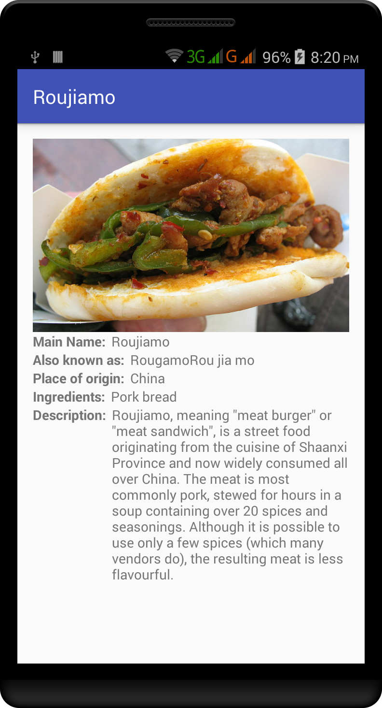
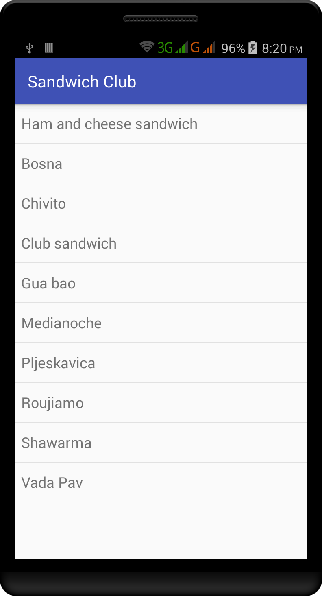
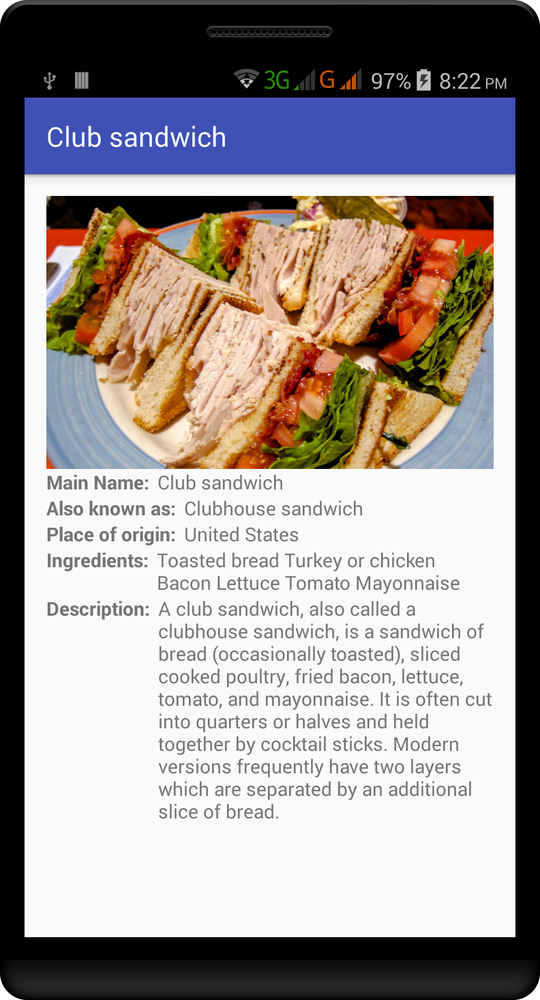
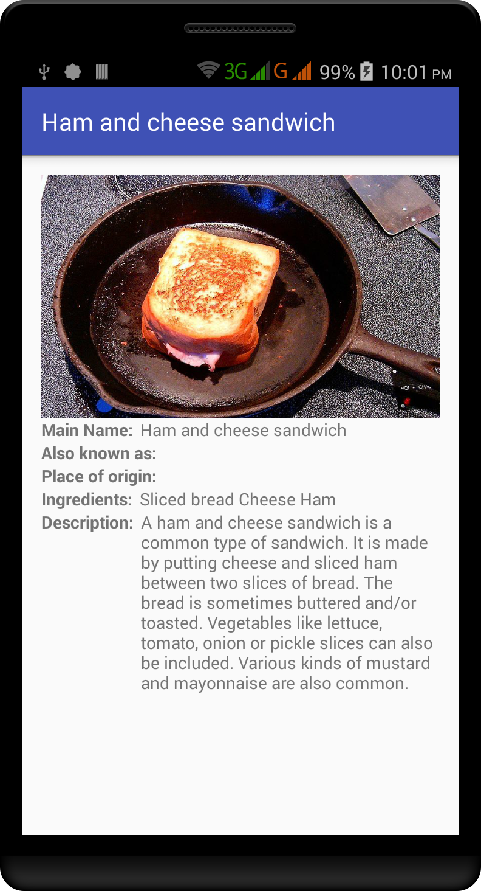

# Sandwich Club Project
Building a layout and populating its fields from data received as JSON
is a common task for Android Developers. 
Design the layout for the detail activity so the different elements
display in a sensible way. Implement the JSON parsing in JsonUtils so it
produces a Sandwich Object that can be used to populate the UI that you designed.

  

  
